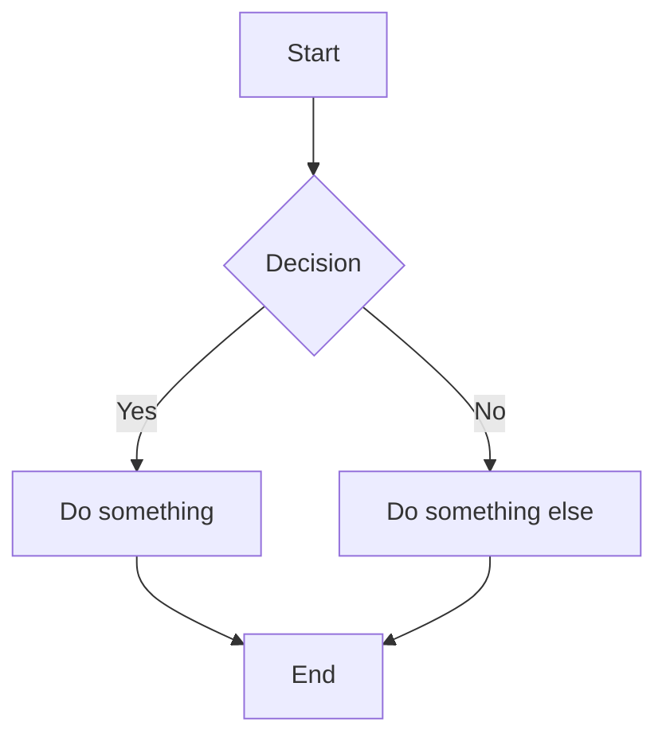
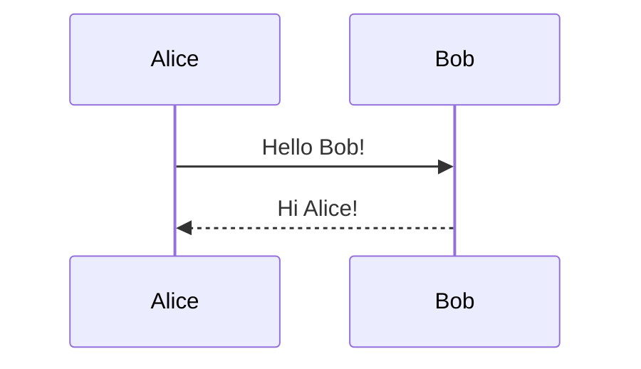

# GitHub-Flavored Markdown (GFM)

GitHub adds several Markdown extensions. These work in READMEs, issues,
pull requests, and comments.

---

## 1. Alerts / Admonitions

```markdown
> [!NOTE]
> Useful information that users should know.

> [!TIP]
> Helpful advice for doing things better or more easily.

> [!IMPORTANT]
> Key information users need to know.

> [!WARNING]
> Urgent info that needs immediate user attention to avoid problems.

> [!CAUTION]
> Advises about risks or negative outcomes of certain actions.
```

> [!NOTE]
> Useful information that users should know.

> [!TIP]
> Helpful advice for doing things better or more easily.

> [!IMPORTANT]
> Key information users need to know.

> [!WARNING]
> Urgent info that needs immediate user attention to avoid problems.

> [!CAUTION]
> Advises about risks or negative outcomes of certain actions.

## 2. Mermaid Diagrams

````markdown

````

### Sequence diagram

````markdown

````

## 3. Math (LaTeX syntax)

Inline math: `$E = mc^2$`

Block math:

````markdown
$$
\sum_{i=1}^{n} x_i = x_1 + x_2 + \cdots + x_n
$$
````

## 4. Emoji

```markdown
:rocket: :tada: :bug: :white_check_mark:
```

Or use Unicode emoji directly: 🚀 🎉 🐛 ✅

## 5. Autolinked References

```markdown
#123          -> links to issue/PR #123
@username     -> links to user profile
SHA: a1b2c3d  -> links to commit
```

## 6. Syntax Highlighting with Diff

````markdown
```diff
- old line removed
+ new line added
  unchanged line
```
````

## 7. Relative Links

```markdown
[See the docs](./docs/README.md)
[License](LICENSE)
```

---

## Key Takeaways

- GFM is a superset of CommonMark
- Alerts, Mermaid, and math are powerful for documentation
- These features only work on GitHub (or compatible renderers)
