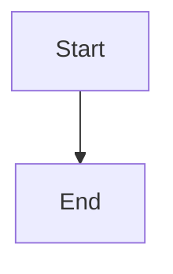
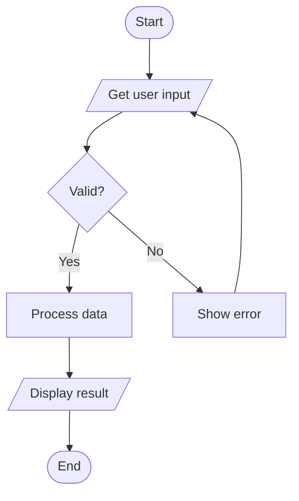
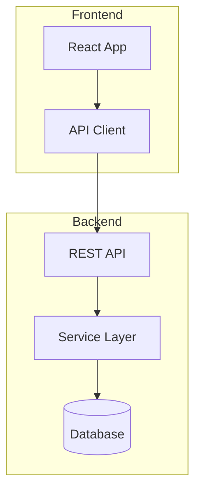
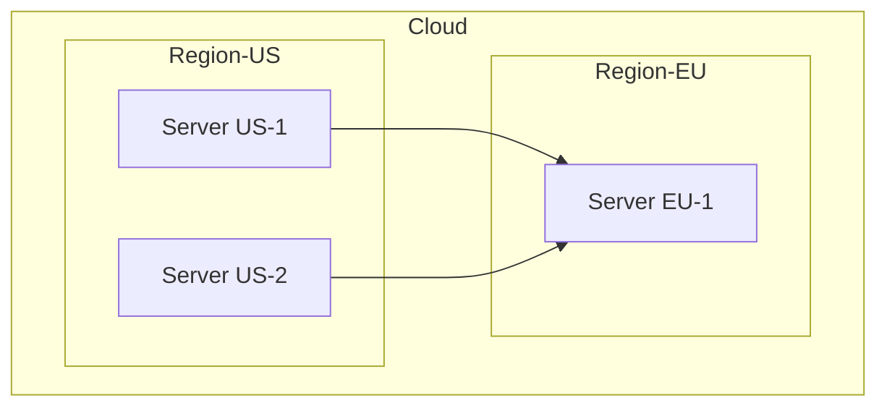
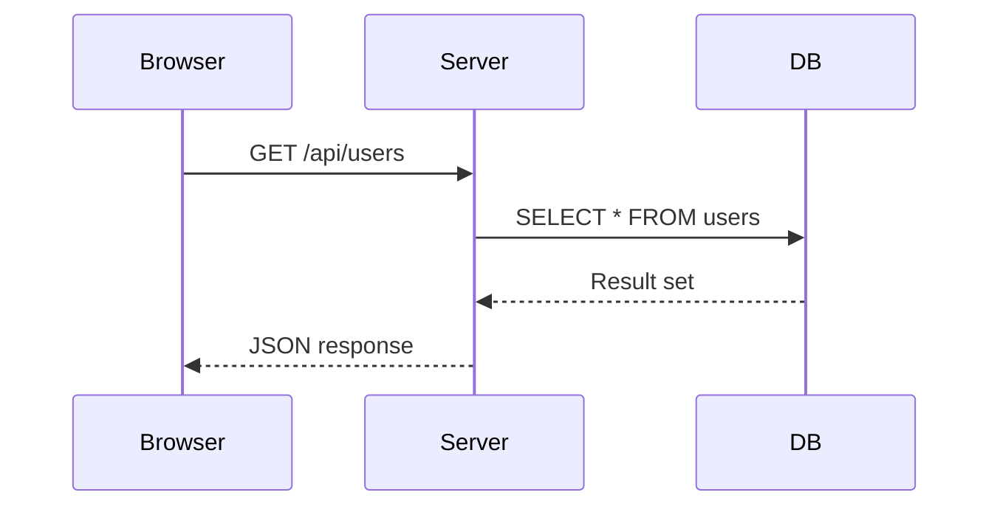
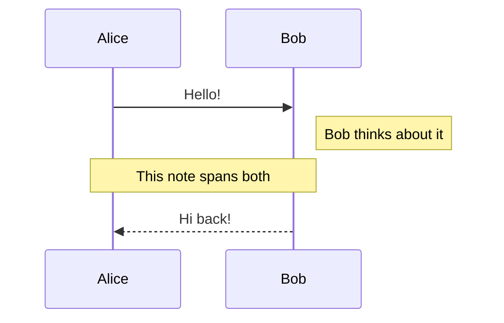
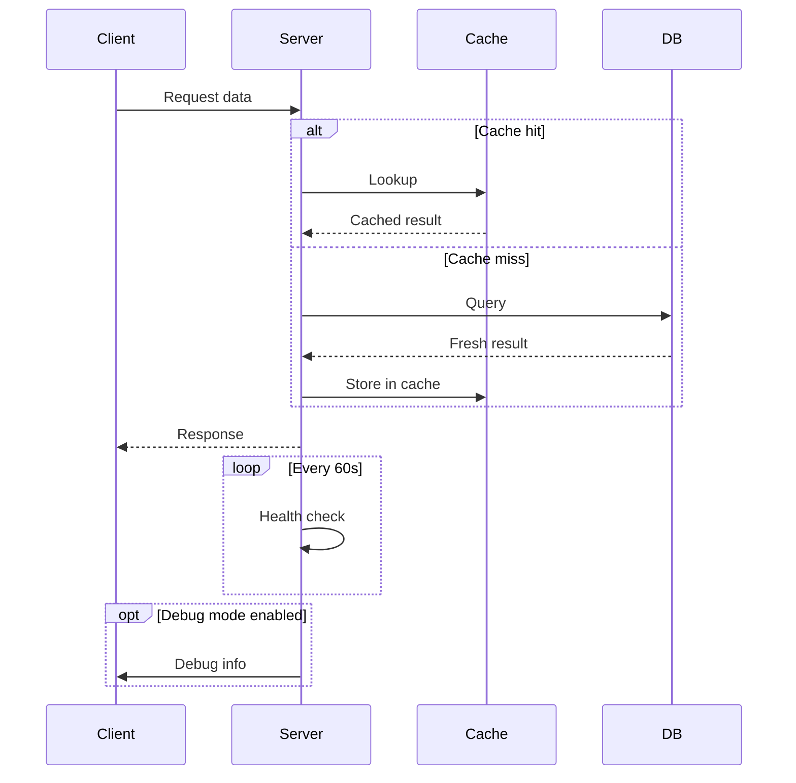
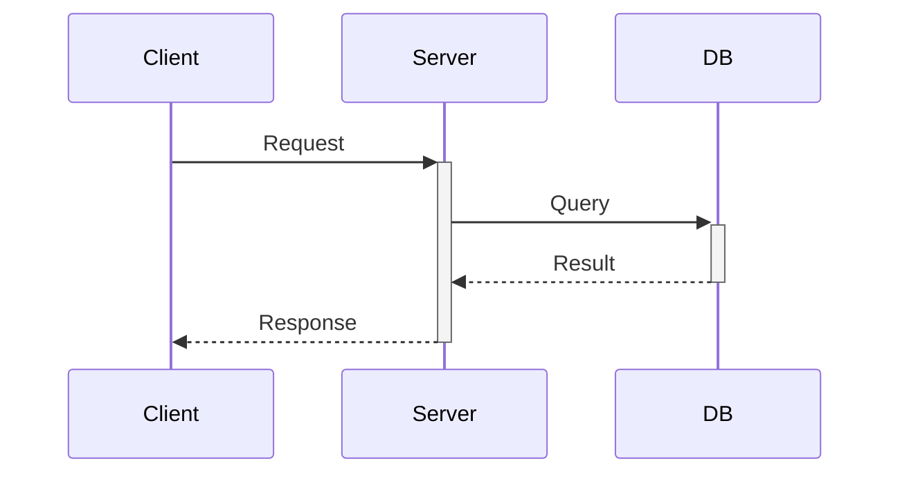
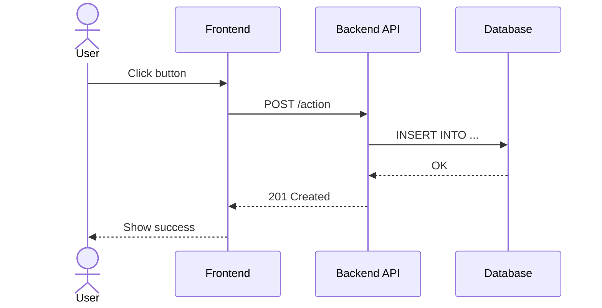
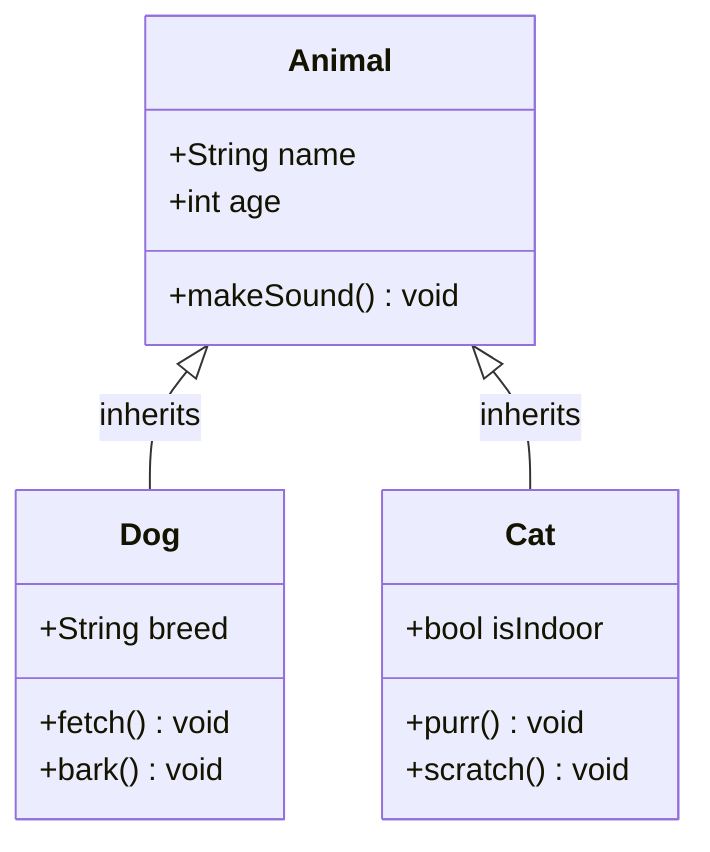

# Mermaid Diagrams

Mermaid is a JavaScript-based diagramming language that renders from text
definitions inside Markdown. GitHub, GitLab, Notion, and many other platforms
support Mermaid natively — no images or external tools needed.

---

## Rendering Mermaid in VS Code

VS Code does not render Mermaid diagrams out of the box in its built-in
Markdown preview. You need an extension:

### Option 1: Markdown Preview Mermaid Support (Recommended)

1. Open VS Code
2. Go to Extensions (`Cmd+Shift+X`)
3. Search for **"Markdown Preview Mermaid Support"** (by Matt Bierner)
4. Click **Install**
5. Open any `.md` file with Mermaid code blocks
6. Open the preview with `Cmd+Shift+V` (or `Cmd+K V` for side-by-side)
7. Mermaid diagrams will now render automatically in the preview pane

### Option 2: Mermaid Markdown Syntax Highlighting

For syntax highlighting inside the code block (not rendering):

1. Search for **"Mermaid Markdown Syntax Highlighting"** in Extensions
2. Install it — you'll get color-coded Mermaid syntax in the editor

### Option 3: Mermaid Editor (Interactive)

1. Search for **"Mermaid Editor"** in Extensions
2. This gives you a live side-by-side editor specifically for Mermaid
3. Useful for drafting complex diagrams before pasting into your Markdown

### Tip: Preview on GitHub

If you push your `.md` file to GitHub, Mermaid blocks render automatically —
no extensions needed. This is the easiest way to share rendered diagrams.

### Tip: Mermaid Live Editor

Visit [mermaid.live](https://mermaid.live) in your browser for a real-time
playground. Paste your Mermaid code, see the output instantly, and export
as SVG or PNG.

---

## 1. Basic Syntax

Wrap Mermaid code in a fenced code block with the `mermaid` language tag:

````markdown

````


---

## 2. Flowcharts

Flowcharts are the most common Mermaid diagram type. Use `graph` followed by
a direction: `TD` (top-down), `LR` (left-right), `BT` (bottom-top), or
`RL` (right-left).

### Node shapes

| Syntax | Shape |
|--------|-------|
| `A[Text]` | Rectangle |
| `A(Text)` | Rounded rectangle |
| `A([Text])` | Stadium / pill |
| `A{Text}` | Diamond (decision) |
| `A[[Text]]` | Subroutine |
| `A[(Text)]` | Database / cylinder |
| `A((Text))` | Circle |
| `A>Text]` | Flag / asymmetric |
| `A[/Text/]` | Parallelogram (input/output) |
| `A[\Text\]` | Reverse parallelogram |
| `A[/Text\]` | Trapezoid |
| `A[\Text/]` | Reverse trapezoid |
| `A{{Text}}` | Hexagon |

### Arrow types

| Syntax | Description |
|--------|-------------|
| `A --> B` | Solid arrow |
| `A --- B` | Solid line (no arrow) |
| `A -.-> B` | Dotted arrow |
| `A ==> B` | Thick arrow |
| `A -- text --> B` | Arrow with label |
| `A -->\|text\| B` | Arrow with label (alternate) |
| `A ~~~ B` | Invisible link (for layout) |
| `A <--> B` | Bidirectional arrow |

### Full flowchart example

````markdown

````



### Subgraphs

Group related nodes into labeled sections:

````markdown

````


### Nested subgraphs

````markdown

````


---

## 3. Sequence Diagrams

Show interactions between participants over time.

````markdown

````


### Arrow types in sequence diagrams

| Syntax | Description |
|--------|-------------|
| `->>` | Solid arrow (synchronous) |
| `-->>` | Dashed arrow (response / async) |
| `-)` | Open arrow (async message) |
| `--)` | Dashed open arrow |
| `-x` | Cross at end (lost message) |
| `--x` | Dashed cross |

### Notes

````markdown

````


### Loops, alternatives, and optionals

````markdown

````


### Activation (lifelines)

Show when a participant is actively processing:

````markdown

````


The `+` activates a participant, `-` deactivates it.

### Participant aliases and actors

````markdown

````


Use `actor` for stick-figure icons, `participant` for box icons.

---

## 4. Class Diagrams

Model classes, their attributes, methods, and relationships.

````markdown

````


### Visibility modifiers

| Symbol | Meaning |
|--------|---------|
| `+` | Public |
| `-` | Private |
| `#` | Protected |
| `~` | Package/Internal |

### Relationship types

| Syntax | Type |
|--------|------|
| `<\|--` | Inheritance |
| `*--` | Composition |
| `o--` | Aggregation |
| `-->` | Association |
| `--` | Link (solid) |
| `..>` | Dependency |
| `..\|>` | Realization / Implementation |

### Full class diagram example

````markdown
```mermaid
classDiagram
    class Shape {
        <<abstract>>
        +float area()*
        +float perimeter()*
    }
    class Circle {
        -float radius
        +Circle(float r)
        +float area()
        +float perimeter()
    }
    class Rectangle {
        -float width
        -float height
        +Rectangle(float w, float h)
        +float area()
        +float perimeter()
    }
    class DrawingCanvas {
        -List~Shape~ shapes
        +addShape(Shape s) void
        +render() void
    }

    Shape <|-- Circle
    Shape <|-- Rectangle
    DrawingCanvas o-- Shape : contains
```
````

```mermaid
classDiagram
    class Shape {
        <<abstract>>
        +float area()*
        +float perimeter()*
    }
    class Circle {
        -float radius
        +Circle(float r)
        +float area()
        +float perimeter()
    }
    class Rectangle {
        -float width
        -float height
        +Rectangle(float w, float h)
        +float area()
        +float perimeter()
    }
    class DrawingCanvas {
        -List~Shape~ shapes
        +addShape(Shape s) void
        +render() void
    }

    Shape <|-- Circle
    Shape <|-- Rectangle
    DrawingCanvas o-- Shape : contains
```

---

## 5. State Diagrams

Model the states and transitions of a system.

````markdown
```mermaid
stateDiagram-v2
    [*] --> Idle
    Idle --> Processing : Submit
    Processing --> Success : Valid
    Processing --> Error : Invalid
    Error --> Idle : Reset
    Success --> [*]
```
````

```mermaid
stateDiagram-v2
    [*] --> Idle
    Idle --> Processing : Submit
    Processing --> Success : Valid
    Processing --> Error : Invalid
    Error --> Idle : Reset
    Success --> [*]
```

### Composite (nested) states

````markdown
```mermaid
stateDiagram-v2
    [*] --> Active

    state Active {
        [*] --> Running
        Running --> Paused : Pause
        Paused --> Running : Resume
    }

    Active --> Completed : Finish
    Active --> Cancelled : Cancel
    Completed --> [*]
    Cancelled --> [*]
```
````

```mermaid
stateDiagram-v2
    [*] --> Active

    state Active {
        [*] --> Running
        Running --> Paused : Pause
        Paused --> Running : Resume
    }

    Active --> Completed : Finish
    Active --> Cancelled : Cancel
    Completed --> [*]
    Cancelled --> [*]
```

### Fork and join (concurrent states)

````markdown
```mermaid
stateDiagram-v2
    [*] --> Ready
    Ready --> Processing

    state Processing {
        state fork_state <<fork>>
        state join_state <<join>>

        fork_state --> ValidateData
        fork_state --> CheckPermissions
        ValidateData --> join_state
        CheckPermissions --> join_state
    }

    Processing --> Done
    Done --> [*]
```
````

```mermaid
stateDiagram-v2
    [*] --> Ready
    Ready --> Processing

    state Processing {
        state fork_state <<fork>>
        state join_state <<join>>

        fork_state --> ValidateData
        fork_state --> CheckPermissions
        ValidateData --> join_state
        CheckPermissions --> join_state
    }

    Processing --> Done
    Done --> [*]
```

### Notes in state diagrams

````markdown
```mermaid
stateDiagram-v2
    [*] --> Active
    Active --> Inactive : Timeout
    note right of Active : User is interacting
    note left of Inactive : Session expired
    Inactive --> [*]
```
````

```mermaid
stateDiagram-v2
    [*] --> Active
    Active --> Inactive : Timeout
    note right of Active : User is interacting
    note left of Inactive : Session expired
    Inactive --> [*]
```

---

## 6. Entity Relationship (ER) Diagrams

Model database schemas and table relationships.

````markdown
```mermaid
erDiagram
    USER ||--o{ POST : writes
    USER ||--o{ COMMENT : writes
    POST ||--o{ COMMENT : has
    POST }o--|| CATEGORY : "belongs to"

    USER {
        int id PK
        string username
        string email
        date created_at
    }
    POST {
        int id PK
        string title
        text body
        int user_id FK
        int category_id FK
        date published_at
    }
    COMMENT {
        int id PK
        text body
        int user_id FK
        int post_id FK
        date created_at
    }
    CATEGORY {
        int id PK
        string name
        string slug
    }
```
````

```mermaid
erDiagram
    USER ||--o{ POST : writes
    USER ||--o{ COMMENT : writes
    POST ||--o{ COMMENT : has
    POST }o--|| CATEGORY : "belongs to"

    USER {
        int id PK
        string username
        string email
        date created_at
    }
    POST {
        int id PK
        string title
        text body
        int user_id FK
        int category_id FK
        date published_at
    }
    COMMENT {
        int id PK
        text body
        int user_id FK
        int post_id FK
        date created_at
    }
    CATEGORY {
        int id PK
        string name
        string slug
    }
```

### Cardinality notation

| Syntax | Meaning |
|--------|---------|
| `\|\|--\|\|` | Exactly one to exactly one |
| `\|\|--o{` | One to zero or more |
| `}o--o{` | Zero or more to zero or more |
| `\|\|--\|{` | One to one or more |
| `}o--\|\|` | Zero or more to exactly one |

### ER diagram with many-to-many (junction table)

````markdown
```mermaid
erDiagram
    STUDENT ||--o{ ENROLLMENT : enrolls
    COURSE ||--o{ ENROLLMENT : has
    COURSE }o--|| DEPARTMENT : "offered by"
    INSTRUCTOR ||--o{ COURSE : teaches

    STUDENT {
        int id PK
        string name
        string email
    }
    COURSE {
        int id PK
        string title
        int credits
        int instructor_id FK
    }
    ENROLLMENT {
        int id PK
        int student_id FK
        int course_id FK
        string grade
        date enrolled_at
    }
```
````

```mermaid
erDiagram
    STUDENT ||--o{ ENROLLMENT : enrolls
    COURSE ||--o{ ENROLLMENT : has
    COURSE }o--|| DEPARTMENT : "offered by"
    INSTRUCTOR ||--o{ COURSE : teaches

    STUDENT {
        int id PK
        string name
        string email
    }
    COURSE {
        int id PK
        string title
        int credits
        int instructor_id FK
    }
    ENROLLMENT {
        int id PK
        int student_id FK
        int course_id FK
        string grade
        date enrolled_at
    }
```

---

## 7. Gantt Charts

Visualize project timelines and task dependencies.

````markdown
```mermaid
gantt
    title Project Timeline
    dateFormat YYYY-MM-DD

    section Planning
    Requirements     :a1, 2024-01-01, 7d
    Design           :a2, after a1, 5d

    section Development
    Backend          :b1, after a2, 14d
    Frontend         :b2, after a2, 14d

    section Testing
    Integration test :c1, after b1, 7d
    UAT              :c2, after c1, 5d
```
````

```mermaid
gantt
    title Project Timeline
    dateFormat YYYY-MM-DD

    section Planning
    Requirements     :a1, 2024-01-01, 7d
    Design           :a2, after a1, 5d

    section Development
    Backend          :b1, after a2, 14d
    Frontend         :b2, after a2, 14d

    section Testing
    Integration test :c1, after b1, 7d
    UAT              :c2, after c1, 5d
```

### Task modifiers

| Syntax | Meaning |
|--------|---------|
| `:active,` | Currently in progress (highlighted) |
| `:done,` | Completed task |
| `:crit,` | Critical path (red) |
| `:milestone,` | Milestone marker (diamond) |

### Gantt chart with all modifiers

````markdown
```mermaid
gantt
    title Sprint 12
    dateFormat YYYY-MM-DD

    section Backend
    Auth service      :done, auth, 2024-03-01, 5d
    User API          :active, api, after auth, 4d
    Database migration:crit, db, after api, 3d

    section Frontend
    Login page        :done, login, 2024-03-01, 3d
    Dashboard         :active, dash, after login, 6d

    section Milestones
    Beta release      :milestone, m1, after db, 0d
    Launch            :milestone, m2, after dash, 0d
```
````

```mermaid
gantt
    title Sprint 12
    dateFormat YYYY-MM-DD

    section Backend
    Auth service      :done, auth, 2024-03-01, 5d
    User API          :active, api, after auth, 4d
    Database migration:crit, db, after api, 3d

    section Frontend
    Login page        :done, login, 2024-03-01, 3d
    Dashboard         :active, dash, after login, 6d

    section Milestones
    Beta release      :milestone, m1, after db, 0d
    Launch            :milestone, m2, after dash, 0d
```

---

## 8. Pie Charts

Simple proportional data visualization.

````markdown
```mermaid
pie title Languages Used
    "JavaScript" : 45
    "Python" : 30
    "Go" : 15
    "Other" : 10
```
````

```mermaid
pie title Languages Used
    "JavaScript" : 45
    "Python" : 30
    "Go" : 15
    "Other" : 10
```

---

## 9. Git Graph

Visualize branching and merging strategies.

````markdown
```mermaid
gitgraph
    commit
    commit
    branch feature
    checkout feature
    commit
    commit
    checkout main
    merge feature
    commit
```
````

```mermaid
gitgraph
    commit
    commit
    branch feature
    checkout feature
    commit
    commit
    checkout main
    merge feature
    commit
```

### Git graph with multiple branches

````markdown
```mermaid
gitgraph
    commit id: "init"
    commit id: "setup"

    branch develop
    checkout develop
    commit id: "dev-1"
    commit id: "dev-2"

    branch feature-auth
    checkout feature-auth
    commit id: "auth-1"
    commit id: "auth-2"

    checkout develop
    merge feature-auth id: "merge auth"

    branch feature-ui
    checkout feature-ui
    commit id: "ui-1"

    checkout develop
    merge feature-ui id: "merge ui"

    checkout main
    merge develop id: "release v1.0" tag: "v1.0"
    commit id: "hotfix"
```
````

```mermaid
gitgraph
    commit id: "init"
    commit id: "setup"

    branch develop
    checkout develop
    commit id: "dev-1"
    commit id: "dev-2"

    branch feature-auth
    checkout feature-auth
    commit id: "auth-1"
    commit id: "auth-2"

    checkout develop
    merge feature-auth id: "merge auth"

    branch feature-ui
    checkout feature-ui
    commit id: "ui-1"

    checkout develop
    merge feature-ui id: "merge ui"

    checkout main
    merge develop id: "release v1.0" tag: "v1.0"
    commit id: "hotfix"
```

---

## 10. Mind Maps

Organize ideas in a tree structure.

````markdown
```mermaid
mindmap
    root((Web Development))
        Frontend
            HTML
            CSS
                Flexbox
                Grid
            JavaScript
                React
                Vue
        Backend
            Node.js
            Python
                Django
                Flask
            Go
        DevOps
            Docker
            CI/CD
            Cloud
                AWS
                GCP
```
````

```mermaid
mindmap
    root((Web Development))
        Frontend
            HTML
            CSS
                Flexbox
                Grid
            JavaScript
                React
                Vue
        Backend
            Node.js
            Python
                Django
                Flask
            Go
        DevOps
            Docker
            CI/CD
            Cloud
                AWS
                GCP
```

---

## 11. Timeline Diagrams

Show chronological events.

````markdown
```mermaid
timeline
    title History of Web Frameworks
    2005 : Django
         : Ruby on Rails
    2009 : Node.js
         : AngularJS
    2013 : React
    2014 : Vue.js
    2016 : Angular 2
    2020 : Svelte 3
    2022 : Fresh (Deno)
    2023 : HTMX resurgence
```
````

```mermaid
timeline
    title History of Web Frameworks
    2005 : Django
         : Ruby on Rails
    2009 : Node.js
         : AngularJS
    2013 : React
    2014 : Vue.js
    2016 : Angular 2
    2020 : Svelte 3
    2022 : Fresh (Deno)
    2023 : HTMX resurgence
```

---

## 12. Quadrant Charts

Position items in a 2x2 matrix for prioritization or comparison.

````markdown
```mermaid
quadrantChart
    title Task Prioritization
    x-axis Low Effort --> High Effort
    y-axis Low Impact --> High Impact

    quadrant-1 Do First
    quadrant-2 Plan Carefully
    quadrant-3 Delegate
    quadrant-4 Eliminate

    Fix login bug: [0.3, 0.9]
    Redesign homepage: [0.8, 0.85]
    Update docs: [0.2, 0.3]
    Refactor auth: [0.7, 0.4]
    Add dark mode: [0.5, 0.6]
```
````

```mermaid
quadrantChart
    title Task Prioritization
    x-axis Low Effort --> High Effort
    y-axis Low Impact --> High Impact

    quadrant-1 Do First
    quadrant-2 Plan Carefully
    quadrant-3 Delegate
    quadrant-4 Eliminate

    Fix login bug: [0.3, 0.9]
    Redesign homepage: [0.8, 0.85]
    Update docs: [0.2, 0.3]
    Refactor auth: [0.7, 0.4]
    Add dark mode: [0.5, 0.6]
```

---

## 13. User Journey Maps

Map user experiences through a process.

````markdown
```mermaid
journey
    title User Shopping Experience
    section Browse
        Visit homepage: 5: User
        Search for product: 4: User
        View product details: 4: User
    section Purchase
        Add to cart: 5: User
        Enter shipping info: 2: User
        Enter payment: 2: User
        Confirm order: 4: User
    section Post-Purchase
        Receive confirmation: 5: User, System
        Track shipment: 3: User, System
        Receive package: 5: User
```
````

```mermaid
journey
    title User Shopping Experience
    section Browse
        Visit homepage: 5: User
        Search for product: 4: User
        View product details: 4: User
    section Purchase
        Add to cart: 5: User
        Enter shipping info: 2: User
        Enter payment: 2: User
        Confirm order: 4: User
    section Post-Purchase
        Receive confirmation: 5: User, System
        Track shipment: 3: User, System
        Receive package: 5: User
```

The number (1-5) represents satisfaction: 5 = great, 1 = terrible.

---

## 14. C4 Diagrams (Software Architecture)

Model system architecture at different levels of detail.

````markdown
```mermaid
C4Context
    title System Context Diagram

    Person(user, "User", "A customer of the system")
    System(webapp, "Web Application", "Main user-facing app")
    System_Ext(email, "Email Service", "Sends emails")
    System_Ext(payment, "Payment Gateway", "Processes payments")

    Rel(user, webapp, "Uses", "HTTPS")
    Rel(webapp, email, "Sends emails via", "SMTP")
    Rel(webapp, payment, "Processes payments via", "API")
```
````

```mermaid
C4Context
    title System Context Diagram

    Person(user, "User", "A customer of the system")
    System(webapp, "Web Application", "Main user-facing app")
    System_Ext(email, "Email Service", "Sends emails")
    System_Ext(payment, "Payment Gateway", "Processes payments")

    Rel(user, webapp, "Uses", "HTTPS")
    Rel(webapp, email, "Sends emails via", "SMTP")
    Rel(webapp, payment, "Processes payments via", "API")
```

---

## 15. Styling and Themes

### Inline styling with `style`

````markdown
```mermaid
graph LR
    A[OK] --> B[Warning] --> C[Error]
    style A fill:#4caf50,color:#fff
    style B fill:#ff9800,color:#fff
    style C fill:#f44336,color:#fff
```
````

```mermaid
graph LR
    A[OK] --> B[Warning] --> C[Error]
    style A fill:#4caf50,color:#fff
    style B fill:#ff9800,color:#fff
    style C fill:#f44336,color:#fff
```

### Class-based styling with `classDef`

````markdown
```mermaid
graph LR
    classDef success fill:#4caf50,color:#fff,stroke:#388e3c
    classDef warning fill:#ff9800,color:#fff,stroke:#f57c00
    classDef danger fill:#f44336,color:#fff,stroke:#d32f2f
    classDef info fill:#2196f3,color:#fff,stroke:#1976d2

    A[Deploy]:::success --> B{Tests pass?}
    B -->|Yes| C[Release]:::info
    B -->|No| D[Fix]:::warning --> E[Retry]:::danger
```
````

```mermaid
graph LR
    classDef success fill:#4caf50,color:#fff,stroke:#388e3c
    classDef warning fill:#ff9800,color:#fff,stroke:#f57c00
    classDef danger fill:#f44336,color:#fff,stroke:#d32f2f
    classDef info fill:#2196f3,color:#fff,stroke:#1976d2

    A[Deploy]:::success --> B{Tests pass?}
    B -->|Yes| C[Release]:::info
    B -->|No| D[Fix]:::warning --> E[Retry]:::danger
```

### Style properties reference

| Property | Example | Description |
|----------|---------|-------------|
| `fill` | `#4caf50` | Background color |
| `color` | `#fff` | Text color |
| `stroke` | `#333` | Border color |
| `stroke-width` | `2px` | Border thickness |
| `stroke-dasharray` | `5 5` | Dashed border |
| `font-size` | `14px` | Text size |

### Theme initialization

Set diagram-wide themes using the `init` directive:

````markdown
```mermaid
%%{init: {'theme': 'forest'}}%%
graph TD
    A[Step 1] --> B[Step 2] --> C[Step 3]
```
````

Available themes: `default`, `neutral`, `dark`, `forest`, `base`.

---

## 16. Practical Tips

### Keep diagrams simple

- If a diagram has more than ~15 nodes, consider splitting it
- Use subgraphs to manage complexity in larger diagrams
- Not everything needs a diagram — use them where they add clarity

### Debugging Mermaid

- Use [mermaid.live](https://mermaid.live) to test and debug diagrams
- Check for missing semicolons, unbalanced brackets, or typos in keywords
- Mermaid error messages appear in the rendered output — read them carefully

### When to use which diagram

| Situation | Diagram Type |
|-----------|-------------|
| Process or workflow | Flowchart (`graph`) |
| API calls / interactions | Sequence diagram |
| OOP class structure | Class diagram |
| System lifecycle | State diagram |
| Database schema | ER diagram |
| Project schedule | Gantt chart |
| Proportional data | Pie chart |
| Git branching strategy | Git graph |
| Brainstorming / hierarchy | Mind map |
| Historical events | Timeline |
| Prioritization matrix | Quadrant chart |
| User experience flow | Journey map |
| System architecture | C4 diagram |

---

## Key Takeaways

- Mermaid renders diagrams from text — no image files to maintain
- Supported natively on GitHub, GitLab, Notion, and many other platforms
- Install **"Markdown Preview Mermaid Support"** in VS Code to preview locally
- Flowcharts, sequence diagrams, and ER diagrams are the most commonly used types
- Use `style` or `classDef` for color and emphasis
- Use [mermaid.live](https://mermaid.live) as a playground for drafting and debugging
- Keep diagrams simple — if it's hard to read as text, it'll be hard to read as a diagram
